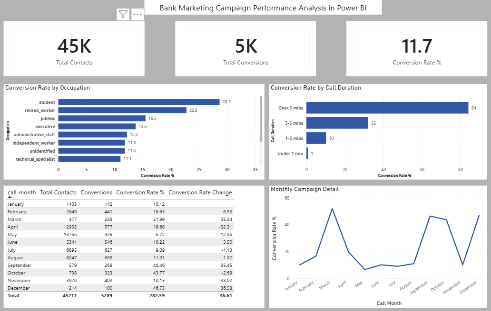

# Bank Marketing Campaign Analysis

## Overview
Analyzed 45,000 records of bank marketing campaign data to identify 
conversion drivers across customer segments, communication channels, 
and time periods.

## Tools Used
- Google BigQuery (SQL)
- Power BI Desktop

## Key Findings
- Retired and student segments had the highest conversion rates
- Call duration over 5 minutes converted significantly better than shorter calls
- Conversion rates peaked in spring and fall, dipping mid-summer

## Dashboard

## SQL Queries
- `conversion_by_segment.sql` — Conversion rate by occupation, age group, and education
- `conversion_by_channel.sql` — Conversion rate by communication channel and call duration
- `monthly_performance.sql` — Month over month campaign performance with conversion rate change

## Data Source
Bank marketing campaign dataset — 45,000 records
